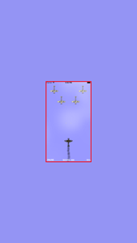
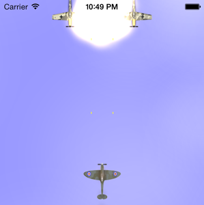

#Introduction

#Building the Game

The following will walk you through how the game was built. It's not a complete explanation of every line of code, but it will give you a good idea of how to set up a similar game for yourself. It would be useful to have a copy of the code when reading this article however. To download the code for yourself and see how it's done, head over to [GitHub](https://github.com/ChrisGrant/FirstSquadron "GitHub First Squadron Repository").

##Game Structure
The structure of the game is relatively simple. 

##Setting up the Scene

The first step when creating the scene is to configure the physics world. 

##Adding the Fighters

The `Fighter` base class defines the common properties and behaviour of a fighter. This makes creating new fighters in future and adding theme to the scene simple. Every fighter fires missiles and has a health. There are currently two subclasses. `HeroFighter` and `EnemyFighter`. Each subclass specifies various properties such as `categoryBitMask`, `collisionBitMask`, `contactTestBitMask` and `mass`. The `HeroFighter` class also sets `allowsRotation` to `NO`. This is how we ensure the fighter always faces the top of the scene.  

The fighters themselves are simply sprite images:

 

These were created in photoshop and based on blueprints of the *Messerschmitt Bf 109* and the *Submarine Spitfire*. 

###Launching Enemy Fighters

The enemy fighters are launched every 5 seconds using an NSTimer. 

	NSTimer *timer = [NSTimer timerWithTimeInterval:5.0 target:self selector:@selector(launchEnemyFighters) userInfo:nil repeats:YES];
    [[NSRunLoop currentRunLoop] addTimer:timer forMode:NSRunLoopCommonModes];
    
This calls the `launchEnemyFighters` method, which instantiates and five `EnemyFighter` instances, rotates them 180 degrees, places them in different locations and then applies an impluse to all of them so they move downwards towards the bottom of the scene.

*5 enemy planes flying in formation*

###Launching the Hero

The hero is added to center of the the scene immediately after the user hits the **START** or **RESTART** buttons.

##Controlling the Hero Plane

To control the hero plane, we instantiate a `CMMotionManager` object in the constructor. On the first update, we want to store a reference to current motion's attitude. By doing so, we can multiply future updates by this reference attitude and use the result as the relative attitude:

	[attitude multiplyByInverseOfAttitude:_referenceAttitude];

By doing so, the user can hold the device at any angle and all future motion updates will be relative to that.

Once we have calculated the relative attitude, we move the plane by applying an impluse:

	[_heroFighter.physicsBody applyImpulse:CGVectorMake(attitude.roll * 250, -attitude.pitch * 200)];
	
This simple block of code gives the user the ability to move the hero around the scene!

##Collision Handling

By setting the `contactDelegate` of the `physicsBody` to self, this allows us to detect collisions. Implementing the following method will give us access to these collisions.

	-(void)didBeginContact:(SKPhysicsContact*)contact

###Hero Collision

The only collisions we are interested in with the hero are with enemy missiles and enemy planes. We check the enemy plane collision in the enemy plane category, so the only scenario we need to cater for in the first if statement is if the hero hits an enemy missile and vice-versa. This leads to a rather convoluted if statement!

	    if((contact.bodyA.categoryBitMask == heroFighterCategory || contact.bodyB.categoryBitMask == heroFighterCategory) &&
       (contact.bodyA.categoryBitMask == enemyMissleCategory || contact.bodyB.categoryBitMask == enemyMissleCategory)) {

If the hero does collide with an enemy missle and we do enter this if statement, we immediately remove the missile and decrement the hero's health by 0.05. 

###Enemy Collision

Whenever an enemy fighter collides with something we want to remove it. However, we want to do different things depending on what the enemy collided with. 

If the enemy collides with the hero, we want to reduce the hero's health by 0.15 and we want the enemy to explode. If the enemy collides with a hero missile, we increment the score by 100 and again we want the enemy to explode.

If the enemy collides with anything else (usually the bounding box for the physics world), we just want to remove it without an explosion.

To add an explosion we use the following code: 

	SKEmitterNode *emitter = [SKEmitterNode emitterNamed:@"Explosion"];
	emitter.position = enemyBody.position;
	emitter.particleAlpha = 0.5;
	[self addChild:emitter];
	[emitter runAction:[SKAction sequence:@[[SKAction fadeAlphaTo:0 duration:0.3], [SKAction removeFromParent]]]];

This just adds an explosion particle emitter where the collision occurred, fades it out over the course of 0.3 seconds and then removes it from the parent.

*An enemy plane exploding*

###Missile Collision

If a missle collides with anything, we want to remove it, regardless of what it was. We do this last as if it colldies with a plane, we want to check that above.

##Keeping the hero inside the visible screen area

We want the hero to stay inside of the visible screen area at all times. Otherwise the user could lose the fighter and not know where it currently is in the scene.  When we are setting up the scene we add a clear `SKSpriteNode` called `heroBox` with a size slightly smaller than the visible screen area. When setting the box's `physicsBody`, we use the `SKPhysicsBody bodyWithEdgeLoopFromRect`. This creates a rectangular loop which will mean the hero can not move outside of that area. To ensure this **only** effects the hero fighter and nothing else in the physics world, we set the physicsBody's `contactTestBitMask` to `heroFighterCategory`. We also must set the `contactTestBitMask` on the hero figher to `heroBoundingBoxCategory` too to ensure that they collide.

#Hints and Tips

-	###Keep it simple
	I originally had the vast majority of my code in `FighterGameScene` when I started out. I was creating sprites and managing them from inside of this class. It's easier at first but as soon as you start adding any complexity it becomes unmanagable. So make sure that your code belongs in the scene and that it has to be there. 

-	###Debugging Collisions
	One of the most time consuming things when creating the game was debugging collisions between `SKPhysicsBody` objects. The first step is ensuring you have set the correct `categoryBitMask` on the objects when you create them, and that they have the correct `contactTestBitMask` too. A `SKPhysicsBody` won't collide with any object that isn't specified in it's `contactTestBitMask`. Also be sure to check *both* bodies of a `SKPhysicsContact`. They aren't guaranteed to be in any particular order. 